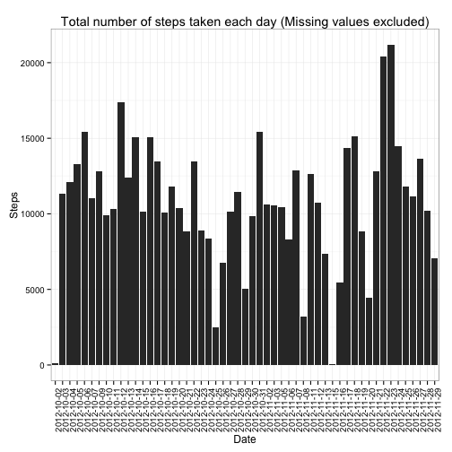
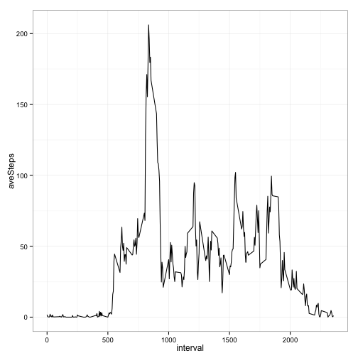
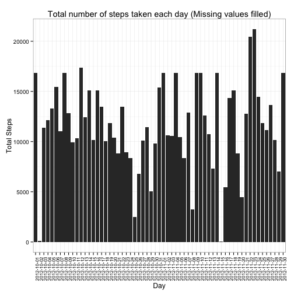
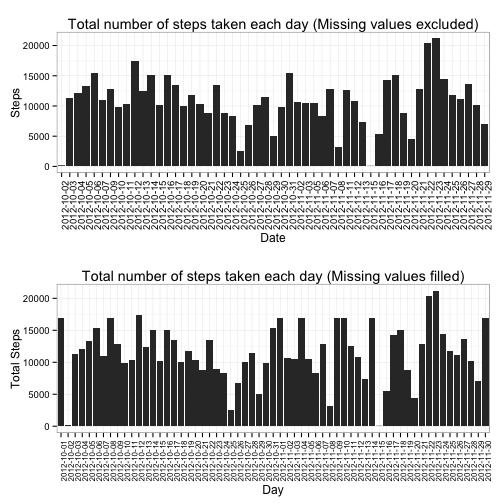
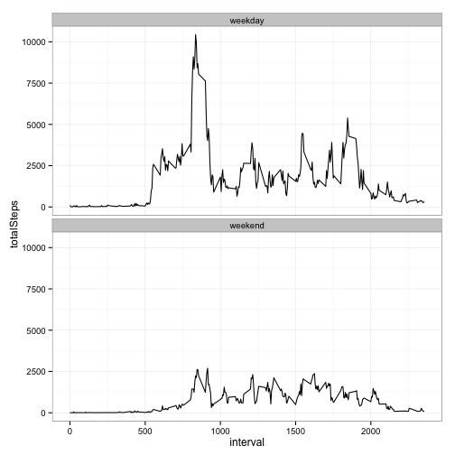

Reproducible Research: Peer Assignment 1
====


## Loading and preprocessing the data


```r
#Packages 
library(xtable)
library(ggplot2)
library(dplyr)
library(tidyr)
library(lubridate)
library(gridExtra)
#Set them for ggplot2
theme_set(theme_bw())
#Read in data
data = read.csv("./data/activity.csv")
```

## Part 1: Ignoring incomplete observations

----


```r
#Removes missing values
dataWOMissing = data[complete.cases(data),]
```


### Qn 1. What is the mean total number of steps taken per day?


```r
#Sums steps within a day
dataWOMissing.bydate = 
dataWOMissing %>% 
group_by(date) %>%
summarise(totalSteps = sum(steps))

meanTotalNumber = mean(dataWOMissing.bydate$totalSteps)
```
The mean total number of steps taken per day is 1.0766189 &times; 10<sup>4</sup>.

#### 1.1 Make a histogram of the total number of steps taken each day


```r
missingPlot = ggplot(dataWOMissing.bydate,aes(date, totalSteps))+
geom_histogram(stat="identity")+
ylab("Steps")+xlab("Date")+
theme(axis.text.x=element_text(angle=90))+
ggtitle("Total number of steps taken each day (Missing values excluded)")
missingPlot
```

 <center><p class="caption">Figure 1 - Histogram of the total number of steps taken each day. Intervals without observations are not included.</p></center>

#### 1.2 Calculate and report the **mean** and **median** total number of steps taken per day


```r
meanSteps = mean(meanTotalNumber)
medianSteps = median(meanTotalNumber)
```

Ignoring intervals and days without observations, the **mean** and **median** total number of steps taken per day are 1.0766189 &times; 10<sup>4</sup> and 1.0766189 &times; 10<sup>4</sup> respectively.

### Qn 2. What is average daily activity pattern

#### 2.1. Make a time series plot of the 5-minute interval (x-axis) and the average number of steps taken, averaged across all days (y-axis)


```r
dataWOMissing.byInterval = dataWOMissing %>%
group_by(interval) %>%
summarise(aveSteps= mean(steps))
```


```r
ggplot(dataWOMissing.byInterval, aes(interval, aveSteps))+
geom_line(aes(group=1))
```

 <center><p class="caption">Figure 2 - Time series plot of the 5-minute interval against the average number of steps taken, averaged across all days.</p></center>

#### 2.2. Which 5-minute interval, on average across all the days in the dataset, contains the maximum number of steps?


```r
intervalrow                        = dataWOMissing.byInterval[with(dataWOMissing.byInterval,aveSteps == max(aveSteps)),]
interval                           = intervalrow[,1]
maxSteps                           = intervalrow[,2]
```

The 835th interval on average, across all the days in the dataset, recorded the maximum number of steps (206.1698113).

## Part 2: Imputing missing values

---

### Qn 3.

#### Qn 3.1 Calculate and report the total number of missing vlaues in the dataset.


```r
missingNAs = sum(!complete.cases(data))
```

In this dataset, there were a total of 2304 rows with `NA`s.

#### Qn 3.2 Devise a strategy for filling in all of the missing values in the dataset. The strategy does not need to be sophisticated. For example, you could use the mean/median for that day, or the mean for that 5-minute interval, etc.

Convert data from long into wide format.


```r
dwide = data %>%
spread(date, steps)
```

<!-- html table generated in R 3.1.1 by xtable 1.7-4 package -->
<!-- Sun Dec 14 09:16:36 2014 -->
<table border=1>
<tr> <th> interval </th> <th> 2012-10-01 </th> <th> 2012-10-02 </th> <th> 2012-10-03 </th> <th> 2012-10-04 </th>  </tr>
  <tr> <td align="right">   0 </td> <td align="right">  </td> <td align="right">   0 </td> <td align="right">   0 </td> <td align="right">  47 </td> </tr>
  <tr> <td align="right">   5 </td> <td align="right">  </td> <td align="right">   0 </td> <td align="right">   0 </td> <td align="right">   0 </td> </tr>
  <tr> <td align="right">  10 </td> <td align="right">  </td> <td align="right">   0 </td> <td align="right">   0 </td> <td align="right">   0 </td> </tr>
  <tr> <td align="right">  15 </td> <td align="right">  </td> <td align="right">   0 </td> <td align="right">   0 </td> <td align="right">   0 </td> </tr>
  <tr> <td align="right">  20 </td> <td align="right">  </td> <td align="right">   0 </td> <td align="right">   0 </td> <td align="right">   0 </td> </tr>
   </table>

Fill the missing cells with value `NA` with *mean* of the 5-minute interval across all days.


```r
filled.wide = as.data.frame(        
t(
  apply(dwide,1, function(row){
    meanVal         = mean(row[!is.na(row)])
    row[is.na(row)] = meanVal
    row
    })  
  )
)
```

#### Qn 3.3 Create a new dataset that is equal to the original dataset but with the missing data filled in.


```r
filled.long = filled.wide %>%
gather(date, steps, -interval)
filled.long$interval = as.integer(filled.long$interval )
```

<!-- html table generated in R 3.1.1 by xtable 1.7-4 package -->
<!-- Sun Dec 14 09:16:36 2014 -->
<table border=1>
<tr> <th> interval </th> <th> date </th> <th> steps </th>  </tr>
  <tr> <td align="right">   0 </td> <td> 2012-10-01 </td> <td align="right"> 1.69 </td> </tr>
  <tr> <td align="right">   5 </td> <td> 2012-10-01 </td> <td align="right"> 0.43 </td> </tr>
  <tr> <td align="right">  10 </td> <td> 2012-10-01 </td> <td align="right"> 0.31 </td> </tr>
  <tr> <td align="right">  15 </td> <td> 2012-10-01 </td> <td align="right"> 0.43 </td> </tr>
  <tr> <td align="right">  20 </td> <td> 2012-10-01 </td> <td align="right"> 0.44 </td> </tr>
  <tr> <td align="right">  25 </td> <td> 2012-10-01 </td> <td align="right"> 2.52 </td> </tr>
   </table>

The data frame `filled.long` is equal to the original dataset `data` but with the missing data filled in.

#### Qn 3.4 
##### 3.4.1 Make a histogram of the total number of steps taken each day.


```r
totalSteps.wMissing = filled.long %>%
group_by(date) %>%
summarise(totalStep = sum(steps)) %>%
gather(measure, value, -date)
```


```r
filledPlot = ggplot(totalSteps.wMissing, aes(date,value))+
geom_histogram(stat="identity")+
theme(axis.text.x=element_text(angle=90, hjust = 1,size=8))+
ylab("Total Steps")+
xlab("Day")+
ggtitle("Total number of steps taken each day (Missing values filled)")
filledPlot
```

 <center><p class="caption">Figure 3 - Histogram of the total number of steps taken each day inclusive of filled empty intervals.</p></center>

##### 3.4.2. Calculate and report the mean and median total number of steps taken per day. 


```r
df.wMissing = data.frame(
meanTotNumber.w.missing = mean(totalSteps.wMissing$value),
medianTotNumber.w.missing = median(medianSteps))
```
<!-- html table generated in R 3.1.1 by xtable 1.7-4 package -->
<!-- Sun Dec 14 09:16:36 2014 -->
<table border=1>
<tr> <th> meanTotNumber.w.missing </th> <th> medianTotNumber.w.missing </th>  </tr>
  <tr> <td align="right"> 11563.65 </td> <td align="right"> 10766.19 </td> </tr>
   </table>

The mean and median total number of steps taken per day are 1.1563648 &times; 10<sup>4</sup> and 1.0766189 &times; 10<sup>4</sup> respectively. 

##### 3.4.3 Do these values differ from the estimates from the first part of the assignment? 


```r
df.Compare           = data.frame(
mean.excluding.NAs   = meanSteps,
mean.NAs.filled      = mean(totalSteps.wMissing$value),
median.excluding.NAs = medianSteps,
median.NAs.fill      = median(medianSteps))
```
<!-- html table generated in R 3.1.1 by xtable 1.7-4 package -->
<!-- Sun Dec 14 09:16:36 2014 -->
<table border=1>
<tr> <th> mean.excluding.NAs </th> <th> mean.NAs.filled </th> <th> median.excluding.NAs </th> <th> median.NAs.fill </th>  </tr>
  <tr> <td align="right"> 10766.19 </td> <td align="right"> 11563.65 </td> <td align="right"> 10766.19 </td> <td align="right"> 10766.19 </td> </tr>
   </table>
Yes, the mean differs however median remains the same.

##### 3.4.4 What is the impact of imputing missing data on the estimates of the total daily number of steps?

The values for median are the same however, for mean the value is higher in the set when the missing values are filled in.


```r
grid.arrange(missingPlot, filledPlot, ncol=1)
```

 <center><p class="caption">Figure 4 - Comparing total number of steps between NA removed and filled data</p></center>

### Qn 4. Are there differences in activity patterns between weekdays and weekends?

#### 4.1 Create a new factor variable in the dataset with two levels – “weekday” and “weekend” indicating whether a given date is a weekday or weekend day.


```r
filled.long$date = ymd(filled.long$date)
filled.long$day = ifelse(test=grepl("Sat|Sun", weekdays(filled.long$date)), yes="weekend",no="weekday")
```

New factor variable is `day`.

#### 4.2 Make a panel plot containing a time series plot (i.e. type = "l") of the 5-minute interval (x-axis) and the average number of steps taken, averaged across all weekday days or weekend days (y-axis). 


```r
filled.long.byDay = filled.long %>%
group_by(interval,day) %>%
summarise(totalSteps = sum(steps))
```


```r
ggplot(filled.long.byDay, aes(interval,totalSteps))+
geom_line()+
facet_wrap(~day, ncol=1)
```

 <center><p class="caption">Figure 5 - A time series plot of the 5-minute interval and the average number of steps taken, averaged across all weekday days or weekend days.</p></center>
